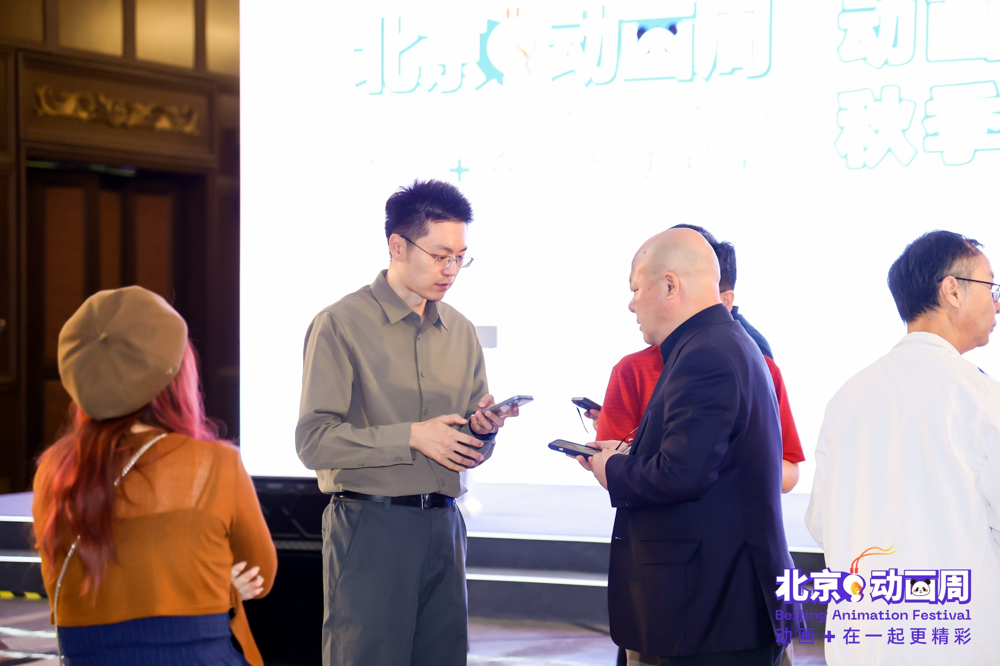

I have a decade of experience in venture capital and currently serve in a management role at an IC reliability testing company, overseeing capital markets, finance, and legal affairs. I hold a bachelor's degree in Control Science from Zhejiang University and a master's degree in Industrial Engineering from Columbia University.

My focus is on artificial intelligence, semiconductors, and the growth of high-tech companies, drawing on both investor and operator perspectives to understand technological shifts, business models, and industry competition.

Here I'd like to share research findings, public interviews, and project retrospectives — the reasoning behind my judgments, lessons learned in practice, and how my thinking evolves as new information emerges. Feel free to reach out about exchange of views, business development, or potential collaborations.

## Media Mentions | 媒体采访与引用

### Dingjiao One | 定焦One

**July 2026 · Quoted interviewee / 受访者**

**Topic / 议题：** MiniMax: multimodal strategy and commercialization / MiniMax 的多模态战略与商业化

**English summary of my comments:** My comments in Dingjiao One examined how markets value different AI business models and whether MiniMax can turn its multimodal capabilities and global products into a sustainable platform business. I proposed three tests for its multimodal strategy: cross-modal transfer, a unified model and training framework, and strong capabilities in each individual modality. My broader focus was whether models, products and user data can form a reinforcing cycle that supports commercialization and a developer ecosystem.

**我的观点：** 讨论 MiniMax 与智谱估值分化背后的商业路径差异，以及模型、产品、数据能否形成正向循环；提出跨模态迁移、统一模型与训练框架、单项能力强度三个观察维度，分析多模态优势能否转化为商业化与平台价值。

**Original article / 报道原题：** [4100亿跌到1000亿，MiniMax怎么了？](https://www.36kr.com/p/3883460428034313)

*Published by Dingjiao One; republished with permission by 36Kr. Article in Chinese.*

*定焦One原创，36氪经授权转载。*

### Economic Daily | 经济日报

**August 2026 · Quoted interviewee / 受访者**

**Topic / 议题：** Development targets for frontier industries / 未来产业的发展目标

**English summary of my comment:** I was quoted in Economic Daily's reporting on the development of frontier industries in China. I noted that some local governments set industrial output targets prematurely and far beyond realistic levels, creating a mismatch with the industry's stage of development.

**我的观点：** 在经济日报关于未来产业发展的报道中，我谈到，部分地方过早设定远超实际的产值目标，与产业当前的发展阶段不匹配。

[Read the article on Economic Daily (Chinese) / 经济日报原文](https://www.jingjiribao.cn/static/detail.jsp?id=673616) · [WeChat version / 微信版](https://mp.weixin.qq.com/s/vC2KxtHf3AGd2wU3DBtmoQ)

## Industry Engagement | 行业参与与评审

### Beijing Animation Festival 2026 | 2026 北京动画周

**September 2026 · Judge, Project Pitching Events / 创投活动评审**

Served on the evaluation panels for two project-pitching events at the 2026 Beijing Animation Festival, covering commercial animation projects and university-originated IP for film and television adaptation.

参与 2026 北京动画周两场创投活动的评审工作，覆盖商业动画项目及高校原创 IP 影视化项目。

**Events / 参与活动：**
- Animation Project Investment Roadshow / 动画精品秋季创投路演大会
- University IP Screen Adaptation Pitching Event / 高校IP影视化作品创投大会

*Networking at the event / 活动现场交流*

[Event coverage by 首都广电 (Chinese) / 首都广电活动报道](https://xinwen.bjd.com.cn/content/s6abbb6e9d5def922be102775.html)
